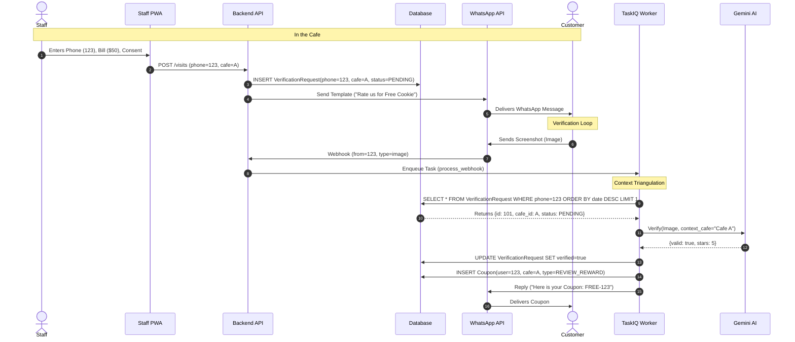
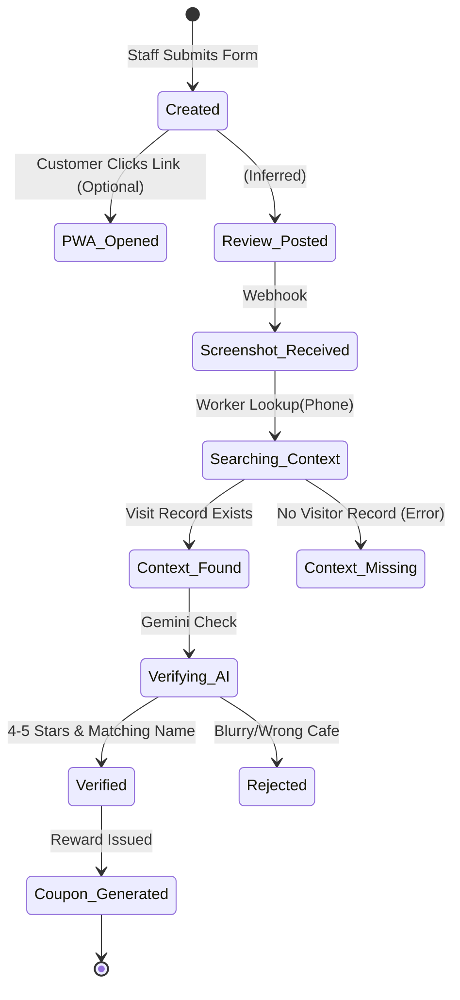
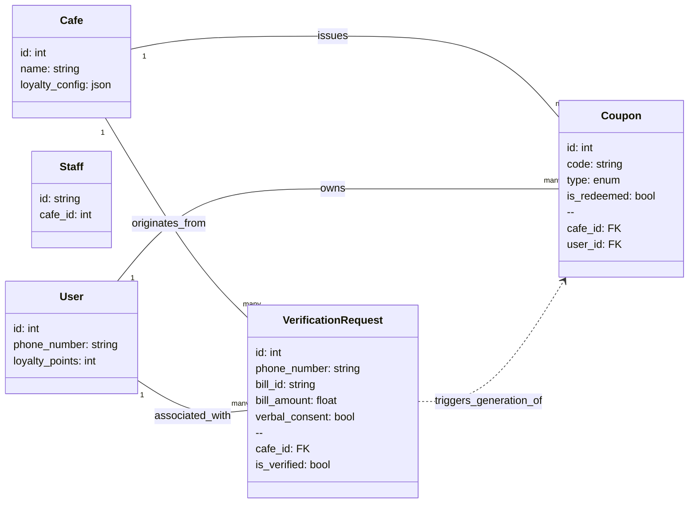

# System Flows & Architecture

## 1. The V0 "Review Hook" Flow (Sequence Diagram)

This diagram illustrates how we link the **Staff's Entry** to the **Customer's WhatsApp Message** via the Phone Number.

## 2. Object State: Verification Request

The life-cycle of a "Visit" record.

## 3. Data Model Relationships (UML)

How the entities link together to support this flow.

